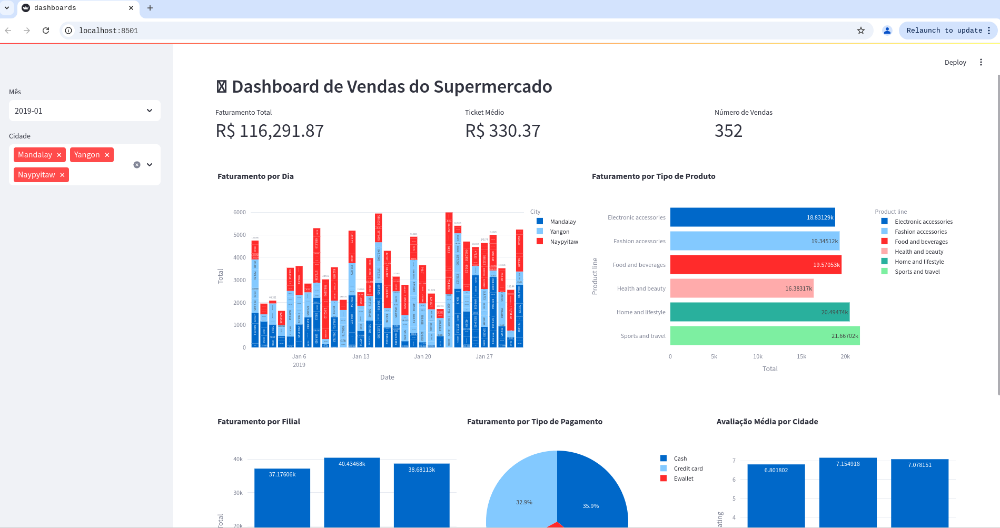

# 📊 Supermarket Sales Dashboard

## 📌 Sobre o Projeto

Este projeto é um dashboard interativo desenvolvido em Python com **Streamlit** e **Plotly** para análise de vendas de um supermercado. O dashboard permite visualizar métricas-chave, como faturamento diário, vendas por filial e métodos de pagamento.

## 🚀 Funcionalidades

- **Filtros dinâmicos**: Selecione o mês e a cidade para análise.
- **Indicadores-Chave (KPIs)**: Exibe faturamento total, ticket médio e número de vendas.
- **Gráficos Interativos**:
  - Faturamento diário
  - Faturamento por tipo de produto
  - Faturamento por filial
  - Faturamento por método de pagamento
  - Avaliação média por cidade

## 🛠️ Tecnologias Utilizadas

- **Python** (Linguagem principal)
- **Streamlit** (Framework para dashboards)
- **Plotly** (Visualização de dados)
- **Pandas** (Manipulação de dados)


## ▶️ Como Rodar o Projeto

1. Clone este repositório:
   ```sh
   git clone https://github.com/pedrosteinmuller/Dashboard_Python.git

2. Acesse o diretório do projeto
```sh
  cd Dashboard_Python
```

3. Crie um ambiente virtual e ative:
```sh
  python -m venv venv
  source venv/bin/activate  # Para macOS/Linux
  venv\Scripts\activate  # Para Windows
```

4. Instale as dependências:
```sh
pip install -r requirements.txt
```

5. Execute o dashboard:
```sh
streamlit run app.py
```

## 📸 Demonstração

Aqui está uma prévia do dashboard em funcionamento:



